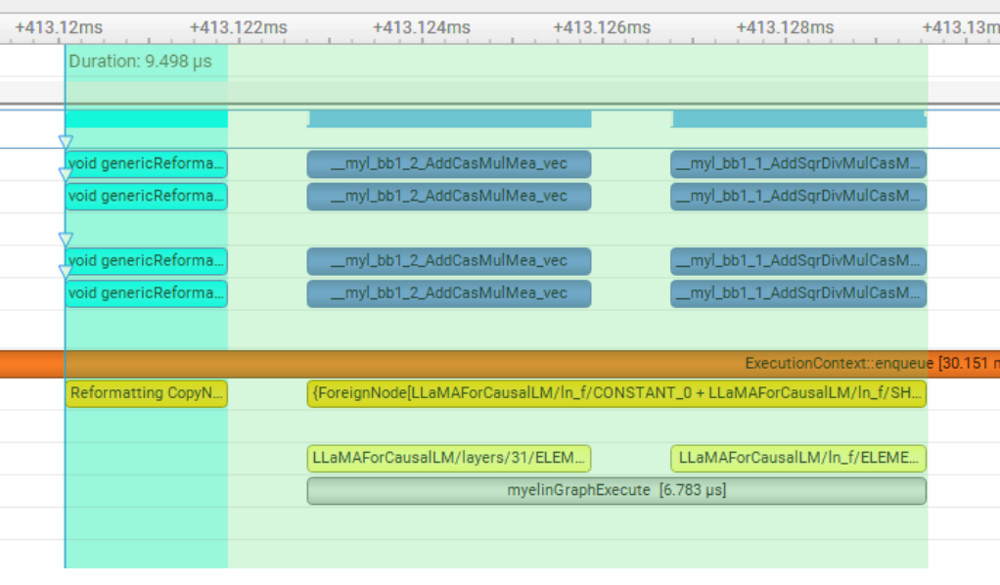
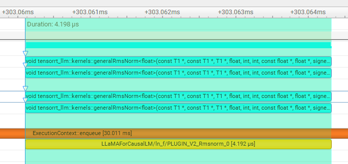

# README.md

### 总述

- 本工作是 [NVIDIA TensorRT Hackathon 2023](<u>[https://github.com/NVIDIA/trt-samples-for-hackathon-cn/tree/master/Hackathon2023](https://github.com/NVIDIA/trt-samples-for-hackathon-cn/tree/master/Hackathon2023)</u>) 的参赛题目，我们采用的选题是 3+4，即在现有模型 llama 的基础上进行优化
- 我们的优化效果如下所示：

时间：

```
TensorRT-LLM (total latency: 67.72877144813538 sec)
```

精度：

- 在 Docker 里面代码编译、运行步骤：

我们使用的编译指令：

```
pip install -e .
./scripts/build_wheel.py --trt_root --clean /usr/local/TensorRT-9.0.0.2
```

使用的 engine 编译指令：

在/root/NVIDIA_TensorRT_Hackathon_2023_Rematch/tensorrt_llm_july-release-v1/examples/llama 下运行

```
python3 build.py --model_dir ./tmp/llama/7B/ \
                    --dtype float16 \
                    --use_gpt_attention_plugin float16 \
                    --use_gemm_plugin float16 \
                    --output_dir ./tmp/llama/7B/trt_engines/fp16/1-gpu/ \
                    --use_RMSnorm_plugin float32
```

编译 engine 后，运行 run.py 指令：

```
python3 run.py --max_output_len=50 \
               --tokenizer_dir ./tmp/llama/7B/ \
               --engine_dir=./tmp/llama/7B/trt_engines/fp16/1-gpu/
```

运行 summarize.py 指令：

```

python summarize.py  --test_trt_llm \
                     --hf_model_location ./tmp/llama/7B/   \
                     --data_type fp16  \
                     --engine_dir ./tmp/llama/7B/trt_engines/fp16/1-gpu/
```

### 主要开发工作

- 主要开发 rmsnorm 的 plugin，以供 tensorrt-LLM 推理的时候使用更高效的 cuda 算子，从而提高推理速度。

#### 开发工作的难点

- 熟悉 tensorrt-LLM，tensorrt-LLM 的 llama 模型通过 build.py 进行 engine 文件的构建，通过 run.py 完成引擎推理，通过 summarize.py 完成模型的评估。（阿里云的网很不好，模型文件下载很容易寄，用了科学上网才解决）
- 熟悉 plugin 编写的整个流程，tensorrt-LLM 在 build.py 中通过标志位的方式来选择是否使用 plugin，在.cpp 中编写 plugin 的接口，在.cu 中编写关键的计算核函数
- 熟悉使用 Nsight profile 工具，查看代码计算耗时是推理加速工作重要的一步，我们小组在考虑如何加速 llama 模型的时候（由于 tensorrt-LLM 已经搭建好了 llama 模型，并且写了一些 plugin 和量化方案，好多常见优化的路都被堵死了......），用 Nsight 对各个子模块进行 profile，最后发现 rmsnorm 是一个优化点，因此定下写 rmsnorm plugin 的方案
- CUDA 核函数的编写，在 rmsnorm 中会涉及到多维的加法、乘法操作，会用到多线程维度计算和规约的并行方法，由于第一次写 CUDA 算子（在 block 中最多只有 1024 个线程的基础知识都不知道），所以还是遇到了很多问题，也学到了很多有关 CUDA 的基础知识。
- 调试问题，关于如何 Debug python 和 C++ 并存的项目也缺乏经验，我们采用 CUDA-GDB 调试 CUDA 代码，用 tensorrt-LLM 自带的 marked_output 来标记层的输出，从而来调试算子的代码
- 精度问题，由于 rmsnorm 的精度会影响到最后的输出，需要用 float32 的精度进行计算。一开始没有注意到这点，导致精度下降，输出存在问题。并且由于在 model 中调试 plugin 存在耦合关系，很难定位具体的问题，我们写了 test_rms_norm.py 来进行单独 plugin 模块进行测试，从而保证 plugin 的精度。
- 编译问题，熟悉整个 tensorrt-LLM 的编译流程，用 pip install -e . 来完成 tensorrt-LLM 的模块搭建。运行./scripts/build_wheel.py --trt_root /usr/local/TensorRT-9.0.0.2 来进行整体项目的编译。在这个过程中，遇到了一个卡我们几天的 bug。因为增量式编译可以只编译修改后的文件，大大减少编译时间，然后有一个函数一直提示未定义，但明明是定义好的，IDE 也可以跳转。后来抱着侥幸心理--clean 重新编译就好了，就后面都正常了，很奇怪。后面也复现不出来这个编译小 bug，就没有提交 bug 了。

#### 开发工作的亮点

- 完成 rmsnorm 的 plugin，这样有模型用到 rmsnorm 算子都可以调用，是一个通用的 plugin。
- 在 llama 模型构建 engine 中成功调用 rmsnorm plugin，从而提高 llama 模型的推理速度。
- CUDA 算子中针对维度进行并行化，针对加法求和采用规约的方法，采用共享内存来管理数据，提高 rmsnorm 算子的推理速度
- 完成 plugin 的 test 部分，从而可以单独测试 rmsnorm plugin 模块，支持 float16 和 float32，float16 精度在 2e-2 之内, float32 精度在 2e-6 之内
- 用 Nsight 工具对 rmsnorm plugin 和原始 rmsnorm 模块进行 profile，从而验证 rmsnorm plugin 加速的有效性。

### 开发与优化过程

在看 llama 的代码中发现，rmsnorm 部分只有简单的类似 pytorch 的推理实现，如下所示：

```
with precision("float32"):
    varx = pow(input, 2.0)  # (-1, -1, 4096)
    varx = varx.mean(dim, keepdim=True)  # (-1, -1, 1)
    denom = varx + eps  # (-1,-1,1)
    denom = denom.sqrt()  # (-1, -1, 1)
    y = input / denom  # (-1, -1, 4096)

if weight is not None:
    y = y * weight  # (-1, -1, 4096)
```

这部分有很多可以并行的地方，因此考虑编写 plugin 来实现代码加速

**以下部分是 python 代码，主要是如何在 build engine 的过程中调用 plugin 进行编译：**

- 在 build.py 中编写接口，从而可以使用不同数据类型的 rmsnorm plugin

```
if args.use_RMSnorm_plugin:
   print(args.use_RMSnorm_plugin)
   network.plugin_config.set_RMSnorm_plugin(dtype=args.use_RMSnorm_plugin)
```

- 在 plugin.py 中设置标志位，使得下一步中可以运行 plugin 部分

```
def set_RMSnorm_plugin(self, dtype='float32'):
        self.RMSnorm_plugin = dtype
        return self
```

- 在 functional.py 中替换原始 rmsnorm 的写法，使得 rms_norm 函数调用对应的 rmsnorm plugin

```
else:  # 加标志位运行这里
        plg_creator = trt.get_plugin_registry().get_plugin_creator('Rmsnorm', '1', TRT_LLM_PLUGIN_NAMESPACE)
        assert plg_creator is not None

        eps = trt.PluginField("eps", np.array(eps, dtype=np.float32),
                    trt.PluginFieldType.FLOAT32)
        p_dtype = default_net().plugin_config.RMSnorm_plugin
        pf_type = trt.PluginField("type_id", np.array([int(str_dtype_to_trt(p_dtype))], np.int32),trt.PluginFieldType.INT32)
        pfc = trt.PluginFieldCollection([eps, pf_type])
        rmsnorm_plug = plg_creator.create_plugin("rmsnorm", pfc)

        if weight is None:
            weight = constant(np.ones(normalized_shape, dtype=str_dtype_to_np(p_dtype)))

        plug_inputs = [input.trt_tensor, weight.trt_tensor]
        layer = default_trtnet().add_plugin_v2(plug_inputs, rmsnorm_plug)
        y =  _create_tensor(layer.get_output(0), layer)
    # ----------------------------------------------------------------
    return y
```

**以下部分是 C++ 代码，主要是如何编写 rmsnorm 的 plugin**

- 在 cpp/tensorrt_llm/plugins/rmsnormPlugin 文件夹下创建 cpp 文件，创建 RmsnormPlugin 类，主要是 enquene 函数编写代码

```
int m = 1;
    for (int i = 0; i < inputDesc[0].dims.nbDims - 1; ++i)
    {
        m *= inputDesc[0].dims.d[i];
    }
    const int n = inputDesc[1].dims.d[0];
    if (mType == DataType::kHALF)       // 运行这里
    {
        const half* input = reinterpret_cast<const half*>(inputs[0]);
        const half* weight = reinterpret_cast<const half*>(inputs[1]);
        half* output = reinterpret_cast<half*>(outputs[0]);
        invokeGeneralRmsNorm(output, input, weight, mEps, m, n, stream);
    }
    else if (mType == DataType::kFLOAT)
    {
        const float* input = reinterpret_cast<const float*>(inputs[0]);
        const float* weight = reinterpret_cast<const float*>(inputs[1]);
        float* output = reinterpret_cast<float*>(outputs[0]);
        invokeGeneralRmsNorm(output, input, weight, mEps, m, n, stream);
    }
```

- 在 cpp/tensorrt_llm/kernels/创建 cuda 算子 rmsnormKernels.cu 文件，编写算子代码，核函数如下所示：

```
template <typename T>
__global__ void generalRmsNorm(const T* input, const T* gamma, T* normed_output, const float eps,
    int tokens, int hidden_dim, const float* scale_orig_quant_per_tensor, float* scale_orig_quant_per_token,
    int8_t* normed_output_quant, bool use_shmem)
{
    constexpr auto num_elems_T = num_elems<T>::value;
    using int8_packed_t = typename packed_as<int8_t, num_elems_T>::type;
    using float_packed_t = typename packed_as<float, num_elems_T>::type;
    using T_scalar = typename packed_as<T, 1>::type;

    extern __shared__ __align__(sizeof(float)) char _shmem[];
    T* shmem = reinterpret_cast<T*>(_shmem);
    // __shared__ float s_mean;
    __shared__ float s_variance;

    const int tidx = threadIdx.x;
    const int bidx = blockIdx.x;

    // float mean = 0.0f;
    float variance = 0.0f;
    float local_sum = 0.0f;
    float local_var_sum = 0.0f;

    const int n_elems = hidden_dim / num_elems_T;
    for (int i = tidx; i < n_elems; i += blockDim.x)
    {
        const T val = input[bidx * n_elems + i];
        if (use_shmem)
        {
            shmem[i] = val;
        }
        const float_packed_t val_f = cuda_cast<float_packed_t>(val);
        // local_sum += cuda_sum<float>(val_f);
        local_var_sum += cuda_sum<float>(val_f * val_f);
    }

    variance = blockReduceSum(local_var_sum);

    if (threadIdx.x == 0)
    {
        variance = (variance / hidden_dim); // Var[x] = E[x²] - E[x]²
        s_variance = rsqrtf(variance + eps);

    }
    __syncthreads();

    const bool with_per_token_scaling = scale_orig_quant_per_token != nullptr;
    const bool with_per_tensor_scaling = scale_orig_quant_per_tensor != nullptr;
    // const bool with_beta = beta != nullptr;
    const float_packed_t scale_orig_quant
        = cuda_cast<float_packed_t>(with_per_tensor_scaling ? *scale_orig_quant_per_tensor : 0.0f);
    T_scalar amax = 1e-6f;

    for (int i = tidx; i < n_elems; i += blockDim.x)
    {
        const int index = bidx * n_elems + i;
        const float_packed_t val_f = cuda_cast<float_packed_t>(use_shmem ? shmem[i] : input[index]);
        const T val = cuda_cast<T>(compute_rmsnorm(val_f, s_variance, gamma, i));
        if (with_per_token_scaling)
        {
            amax = cuda_max(cuda_max<T_scalar, T>(cuda_abs(val)), amax);
            if (use_shmem)
            {
                shmem[i] = val;
            }
        }
        else if (with_per_tensor_scaling)
        {
            reinterpret_cast<int8_packed_t*>(normed_output_quant)[index]
                = cuda_cast<int8_packed_t>(cuda_cast<float_packed_t>(val) * scale_orig_quant);
        }
        else
        {
            normed_output[index] = val;
        }
    }

    if (with_per_token_scaling)
    {
        float abs_max_f = blockAllReduceMax(cuda_cast<float>(amax));
        const float dynamic_per_token_scale = 127.f / abs_max_f;
        for (int i = tidx; i < n_elems; i += blockDim.x)
        {
            const int index = bidx * n_elems + i;
            float_packed_t val_f = cuda_cast<float_packed_t>(use_shmem ? shmem[i] : input[index]);
            if (!use_shmem)
            {
                val_f = compute_rmsnorm(val_f, s_variance, gamma, i);
            }

            reinterpret_cast<int8_packed_t*>(normed_output_quant)[index]
                = cuda_cast<int8_packed_t>(val_f * cuda_cast<float_packed_t>(dynamic_per_token_scale));
        }
        if (tidx == 0)
        {
            scale_orig_quant_per_token[bidx] = abs_max_f / 127.f;
        }
    }
}
```

至此，rmsnorm plugin 完成。

并且，我们还完成了 plugin 的 test 功能，从而能单独测试 plugin 的精度，以验证 plugin 编写的准确性，测试代码在 tensorrt_llm_july-release-v1/tests/functional/test_rms_norm.py 下面，测试代码如下

```
import unittest

import numpy as np
import torch
from parameterized import parameterized
from polygraphy.backend.trt import CreateConfig, EngineFromNetwork, TrtRunner

import tensorrt_llm
from tensorrt_llm import Parameter, Tensor
from tensorrt_llm._utils import torch_to_numpy
class RMSNorm(torch.nn.Module):
    def __init__(self, dim: int, eps: float = 1e-6):
        super().__init__()
        self.eps = eps
        self.weight = torch.randn((dim), dtype=torch.float32, device="cuda")

    def _norm(self, x):
        return x * torch.rsqrt(x.pow(2).mean(-1, keepdim=True) + self.eps)

    def forward(self, x):
        output = self._norm(x.float()).type_as(x)
        return output * self.weight

class TestFunctional(unittest.TestCase):

    def setUp(self):
        tensorrt_llm.logger.set_level('error')
        torch.manual_seed(42)

    @parameterized.expand([['float16'], ['float32'], ['bfloat16']])
    def test_layer_norm_plugin(self, dtype):
        # test data
        hidden_size = 4096
        x_data = torch.randn((8, 128, hidden_size),
                             dtype=torch.float64,
                             device="cuda")  # torch.Size([8, 128, 1024])
        weight = torch.randn((hidden_size), dtype=torch.float64, device="cuda")
        bias = torch.randn((hidden_size), dtype=torch.float64, device="cuda")
        eps = 1e-5
        m = RMSNorm(hidden_size, eps)
        # m = torch.nn.LayerNorm(hidden_size,
        #                        eps=eps,
        #                        dtype=torch.float64,
        #                        device="cuda")
        # m.weight = torch.nn.Parameter(weight)
        # m.bias = torch.nn.Parameter(bias)

        # pytorch run
        with torch.no_grad():
            ref = m(x_data)

        m.to(tensorrt_llm._utils.str_dtype_to_torch(dtype))
        x_data = x_data.to(tensorrt_llm._utils.str_dtype_to_torch(dtype))

        gamma_data = m.weight.detach().cpu()
        # beta_data = m.bias.detach().cpu()

        # construct trt network
        builder = tensorrt_llm.Builder()
        net = builder.create_network()
        net.plugin_config.set_RMSnorm_plugin(dtype)
        with tensorrt_llm.net_guard(net):
            network = tensorrt_llm.default_trtnet()
            x = Tensor(name='x',
                       shape=x_data.shape,
                       dtype=tensorrt_llm.str_dtype_to_trt(dtype))
            weight = Parameter(torch_to_numpy(gamma_data.cpu())).value
            # bias = Parameter(torch_to_numpy(beta_data.cpu())).value

            output = tensorrt_llm.functional.rms_norm(x, hidden_size, weight,
                                                         eps).trt_tensor
            output.name = 'output'
            network.mark_output(output)
            output.dtype = tensorrt_llm.str_dtype_to_trt(dtype)

        # trt run
        build_engine = EngineFromNetwork(
            (builder.trt_builder, net.trt_network),
            config=CreateConfig(fp16=(dtype == 'float16'),
                                bf16=(dtype == 'bfloat16')))
        assert build_engine is not None, "Build engine failed"
        with TrtRunner(build_engine) as runner:
            outputs = runner.infer(feed_dict={'x': x_data.cpu()})

        # compare diff
        dtype_atol = {"float16": 2e-2, "float32": 2e-6, "bfloat16": 8e-2}
        np.testing.assert_allclose(ref.cpu().numpy(),
                                   outputs['output'].to(torch.float32),
                                   atol=dtype_atol[dtype])
        
if __name__ == "__main__":
    unittest.main()
```

### 优化效果

#### 云主机环境

**硬件环境**

- CPU Architecture: x86_64
- CPU Cores: 16
- CPU Model: Intel Xeon Platinum 8369B @ 2.90GHz
- NUMA Nodes: Single node with CPUs 0-15
- Total memory: 58GiB

**软件环境**

- Operating System: Ubuntu 22.04.2 LTS
- Docker Version: 24.0.5

#### 对比测试

我们的工作为针对 `llama` 的模型优化，以下是精度对比测试和性能加速测试的结果。

**精度**

在 tensorrt-LLM 中运行 build.py 和 summarize.py 后得到的精度如下所示：

```
[08/31/2023-11:12:48] [TRT-LLM] [I] TensorRT-LLM beam 0 result
[08/31/2023-11:12:48] [TRT-LLM] [I]   rouge1 : 20.762954367545632
[08/31/2023-11:12:48] [TRT-LLM] [I]   rouge2 : 5.683615121132041
[08/31/2023-11:12:48] [TRT-LLM] [I]   rougeL : 15.54620501769291
[08/31/2023-11:12:48] [TRT-LLM] [I]   rougeLsum : 18.385163805623428
```

在加入 rmsnorm plugin 后精度如下所示：

```
[09/19/2023-13:11:32] [TRT-LLM] [I] TensorRT-LLM beam 0 result
[09/19/2023-13:11:32] [TRT-LLM] [I]   rouge1 : 20.29824254208154
[09/19/2023-13:11:32] [TRT-LLM] [I]   rouge2 : 5.683615121132041
[09/19/2023-13:11:32] [TRT-LLM] [I]   rougeL : 15.38370548448208
[09/19/2023-13:11:32] [TRT-LLM] [I]   rougeLsum : 18.120947608991973
```

**性能**


- 用原始 functional.py 的 rmsnorm 进行 profile，计算时间为 9.5us 左右，如下所示：



加入 rmsnorm plugin 进行 profile，计算时间约为 4.2us 左右，如下图所示：



- 在 tensorrt-LLM 中运行 build.py 和 summarize.py 后得到的时间如下所示：

```
[09/19/2023-13:11:32] [TRT-LLM] [I] TensorRT-LLM (total latency: 67.993452693425 sec)
```

在加入 rmsnorm plugin 后时间如下所示：

```
[09/19/2023-13:11:32] [TRT-LLM] [I] TensorRT-LLM (total latency: 67.611492395401 sec)
```

### 送分题答案

#### 送分题 1

运行命令

- python3 run.py --max_output_len=8

得到输出如下

```
root@6375fe14b223:~/workspace/tensorrt_llm_july-release-v1/examples/gpt# python3 run.py --max_output_len=8

Input: Born in north-east France, Soyer trained as a
Output:  chef and eventually became a chef at a
```

#### 送分题 2

运行命令

- python3 summarize.py --engine_dirtrt_engine/gpt2/fp16/1-gpu --test_hf --batch_size1 --test_trt_llm --hf_model_location=gpt2 --check_accuracy --tensorrt_llm_rouge1_threshold=14

得到输出如下

```
root@6375fe14b223:~/workspace/tensorrt_llm_july-release-v1/examples/gpt# python3 summarize.py --engine_dir trt_engine/gpt2/fp16/1-gpu                      --test_hf                      --batch_size 1                      --test_trt_llm                      --hf_model_location=gpt2                      --check_accuracy                      --tensorrt_llm_rouge1_threshold=14

[08/18/2023-15:32:26] [TRT-LLM] [I] ---------------------------------------------------------
[08/18/2023-15:32:26] [TRT-LLM] [I] TensorRT-LLM Generated : 
[08/18/2023-15:32:26] [TRT-LLM] [I]  Input : ['(CNN)James Best, best known for his portrayal of bumbling sheriff Rosco P. Coltrane on TV\'s "The Dukes of Hazzard," died Monday after a brief illness. He was 88. Best died in hospice in Hickory, North Carolina, of complications from pneumonia, said Steve Latshaw, a longtime friend and Hollywood colleague. Although he\'d been a busy actor for decades in theater and in Hollywood, Best didn\'t become famous until 1979, when "The Dukes of Hazzard\'s" cornpone charms began beaming into millions of American homes almost every Friday night. For seven seasons, Best\'s Rosco P. Coltrane chased the moonshine-running Duke boys back and forth across the back roads of fictitious Hazzard County, Georgia, although his "hot pursuit" usually ended with him crashing his patrol car. Although Rosco was slow-witted and corrupt, Best gave him a childlike enthusiasm that got laughs and made him endearing. His character became known for his distinctive "kew-kew-kew" chuckle and for goofy catchphrases such as "cuff \'em and stuff \'em!" upon making an arrest. Among the most popular shows on TV in the early \'80s, "The Dukes of Hazzard" ran until 1985 and spawned TV movies, an animated series and video games. Several of Best\'s "Hazzard" co-stars paid tribute to the late actor on social media. "I laughed and learned more from Jimmie in one hour than from anyone else in a whole year," co-star John Schneider, who played Bo Duke, said on Twitter. "Give Uncle Jesse my love when you see him dear friend." "Jimmy Best was the most constantly creative person I have ever known," said Ben Jones, who played mechanic Cooter on the show, in a Facebook post. "Every minute of his long life was spent acting, writing, producing, painting, teaching, fishing, or involved in another of his life\'s many passions." Born Jewel Guy on July 26, 1926, in Powderly, Kentucky, Best was orphaned at 3 and adopted by Armen and Essa Best, who renamed him James and raised him in rural Indiana. Best served in the Army during World War II before launching his acting career. In the 1950s and 1960s, he accumulated scores of credits, playing a range of colorful supporting characters in such TV shows as "The Twilight Zone," "Bonanza," "The Andy Griffith Show" and "Gunsmoke." He later appeared in a handful of Burt Reynolds\' movies, including "Hooper" and "The End." But Best will always be best known for his "Hazzard" role, which lives on in reruns. "Jimmie was my teacher, mentor, close friend and collaborator for 26 years," Latshaw said. "I directed two of his feature films, including the recent \'Return of the Killer Shrews,\' a sequel he co-wrote and was quite proud of as he had made the first one more than 50 years earlier." People we\'ve lost in 2015 . CNN\'s Stella Chan contributed to this story.']
[08/18/2023-15:32:26] [TRT-LLM] [I] 
 Reference : ['James Best, who played the sheriff on "The Dukes of Hazzard," died Monday at 88 .\n"Hazzard" ran from 1979 to 1985 and was among the most popular shows on TV .']
[08/18/2023-15:32:26] [TRT-LLM] [I] 
 Output : [[' Best died at age 88.']]
[08/18/2023-15:32:26] [TRT-LLM] [I] ---------------------------------------------------------
[08/18/2023-15:32:27] [TRT-LLM] [I] ---------------------------------------------------------
[08/18/2023-15:32:27] [TRT-LLM] [I] HF Generated : 
[08/18/2023-15:32:27] [TRT-LLM] [I]  Input : ['(CNN)James Best, best known for his portrayal of bumbling sheriff Rosco P. Coltrane on TV\'s "The Dukes of Hazzard," died Monday after a brief illness. He was 88. Best died in hospice in Hickory, North Carolina, of complications from pneumonia, said Steve Latshaw, a longtime friend and Hollywood colleague. Although he\'d been a busy actor for decades in theater and in Hollywood, Best didn\'t become famous until 1979, when "The Dukes of Hazzard\'s" cornpone charms began beaming into millions of American homes almost every Friday night. For seven seasons, Best\'s Rosco P. Coltrane chased the moonshine-running Duke boys back and forth across the back roads of fictitious Hazzard County, Georgia, although his "hot pursuit" usually ended with him crashing his patrol car. Although Rosco was slow-witted and corrupt, Best gave him a childlike enthusiasm that got laughs and made him endearing. His character became known for his distinctive "kew-kew-kew" chuckle and for goofy catchphrases such as "cuff \'em and stuff \'em!" upon making an arrest. Among the most popular shows on TV in the early \'80s, "The Dukes of Hazzard" ran until 1985 and spawned TV movies, an animated series and video games. Several of Best\'s "Hazzard" co-stars paid tribute to the late actor on social media. "I laughed and learned more from Jimmie in one hour than from anyone else in a whole year," co-star John Schneider, who played Bo Duke, said on Twitter. "Give Uncle Jesse my love when you see him dear friend." "Jimmy Best was the most constantly creative person I have ever known," said Ben Jones, who played mechanic Cooter on the show, in a Facebook post. "Every minute of his long life was spent acting, writing, producing, painting, teaching, fishing, or involved in another of his life\'s many passions." Born Jewel Guy on July 26, 1926, in Powderly, Kentucky, Best was orphaned at 3 and adopted by Armen and Essa Best, who renamed him James and raised him in rural Indiana. Best served in the Army during World War II before launching his acting career. In the 1950s and 1960s, he accumulated scores of credits, playing a range of colorful supporting characters in such TV shows as "The Twilight Zone," "Bonanza," "The Andy Griffith Show" and "Gunsmoke." He later appeared in a handful of Burt Reynolds\' movies, including "Hooper" and "The End." But Best will always be best known for his "Hazzard" role, which lives on in reruns. "Jimmie was my teacher, mentor, close friend and collaborator for 26 years," Latshaw said. "I directed two of his feature films, including the recent \'Return of the Killer Shrews,\' a sequel he co-wrote and was quite proud of as he had made the first one more than 50 years earlier." People we\'ve lost in 2015 . CNN\'s Stella Chan contributed to this story.']
[08/18/2023-15:32:27] [TRT-LLM] [I] 
 Reference : ['James Best, who played the sheriff on "The Dukes of Hazzard," died Monday at 88 .\n"Hazzard" ran from 1979 to 1985 and was among the most popular shows on TV .']
[08/18/2023-15:32:27] [TRT-LLM] [I] 
 Output : [[' Best died at age 88.']]
[08/18/2023-15:32:27] [TRT-LLM] [I] ---------------------------------------------------------
Downloading builder script: 5.60kB [00:00, 15.7kB/s]                            
Token indices sequence length is longer than the specified maximum sequence length for this model (1151 > 1024). Running this sequence through the model will result in indexing errors
[08/18/2023-15:33:05] [TRT-LLM] [I] TensorRT-LLM (total latency: 2.641429901123047 sec)
[08/18/2023-15:33:05] [TRT-LLM] [I] TensorRT-LLM beam 0 result
[08/18/2023-15:33:05] [TRT-LLM] [I]   rouge1 : 15.361040799540035
[08/18/2023-15:33:05] [TRT-LLM] [I]   rouge2 : 3.854022269668396
[08/18/2023-15:33:05] [TRT-LLM] [I]   rougeL : 12.078455591738333
[08/18/2023-15:33:05] [TRT-LLM] [I]   rougeLsum : 13.547802733617264
[08/18/2023-15:33:05] [TRT-LLM] [I] Hugging Face (total latency: 10.247140169143677 sec)
[08/18/2023-15:33:05] [TRT-LLM] [I] HF beam 0 result
[08/18/2023-15:33:05] [TRT-LLM] [I]   rouge1 : 14.75593024343394
[08/18/2023-15:33:05] [TRT-LLM] [I]   rouge2 : 3.3647470801871733
[08/18/2023-15:33:05] [TRT-LLM] [I]   rougeL : 11.124766996533
[08/18/2023-15:33:05] [TRT-LLM] [I]   rougeLsum : 13.031128048110618
```

### 经验与体会

- 项目中生成大型文件较多，生成时间长，如何进行 Git 多人协作，如何保证大文件版本同步是一个难题
- 初次接触 tensorrt 和 cuda，挫折很多，比如一个 block 中最多只有 1024 个线程，在实战中也确实学习到不少知识。知道该如何编写 cuda 核函数，知道整个 plugin 流程是怎么样的，对 tensorrt 的认识更加深刻了。
- 对大语言模型的优化点有了一些了解。量化的作用，kv cache 优化这些词汇的理解更加深入了，想去尝试 AutoGPTQ 的量化导入，但由于时间来不及了，就没有完成。
- 非常感谢导师的耐心解答，感谢 nvidia 给予了我们一次学习的机会。希望 tensorrt 被更加广泛的应用，真的是一个 Nice work！
